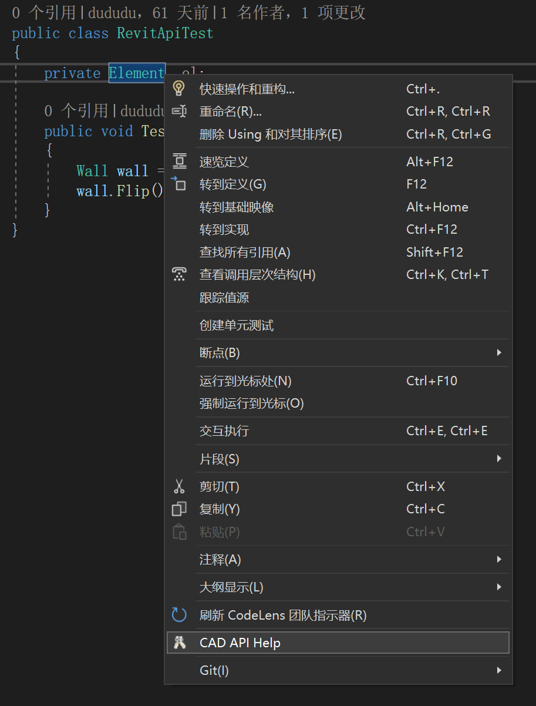

# yourCADAPITools

A visual studio extension that helps to navigate to api doc online with right click in vs directly.

# Visual Studio 2022

# Support Namespace

| Software | Status | OnlineDoc | More |
| :-----| ----: | :----: | :----: | 
| Revit | ✔ | [revitapidocs](https://www.revitapidocs.com/) | [RevitAPIDocGen](https://github.com/chuongmep/RevitAPIDocGen) |
| SolidWorks | ✔ | [sldworksapiprogguide](https://help.solidworks.com/2022/English/api/sldworksapiprogguide/Welcome.htm) |        |
| Rhino Common | ✔ | [RhinoCommon](https://developer.rhino3d.com/api/RhinoCommon/html/R_Project_RhinoCommon.htm)